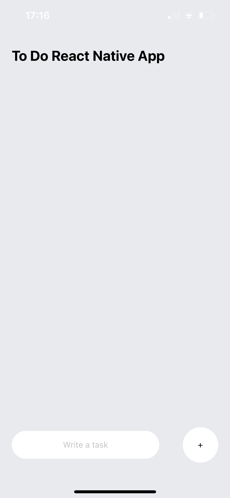
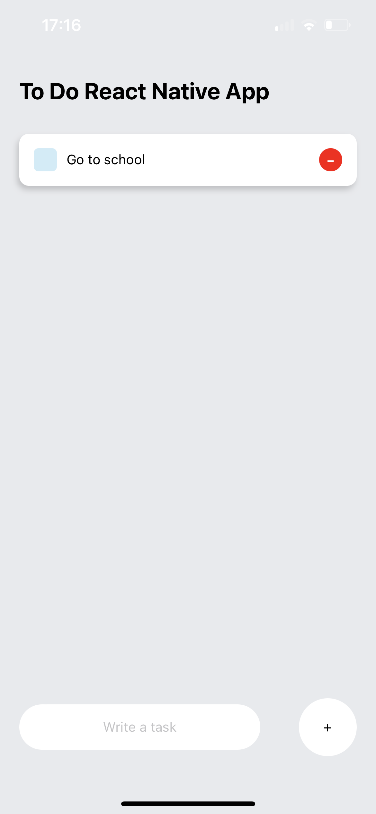
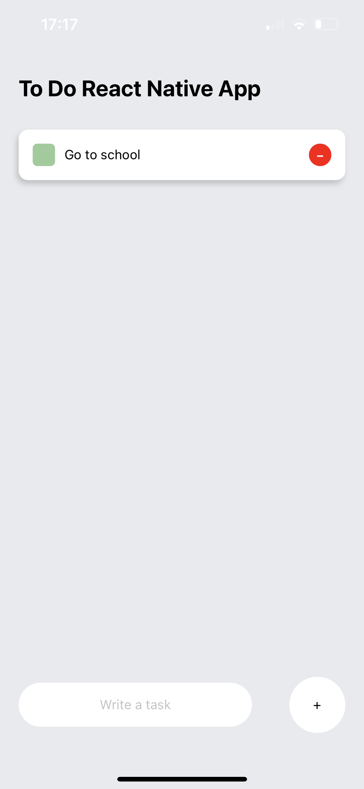
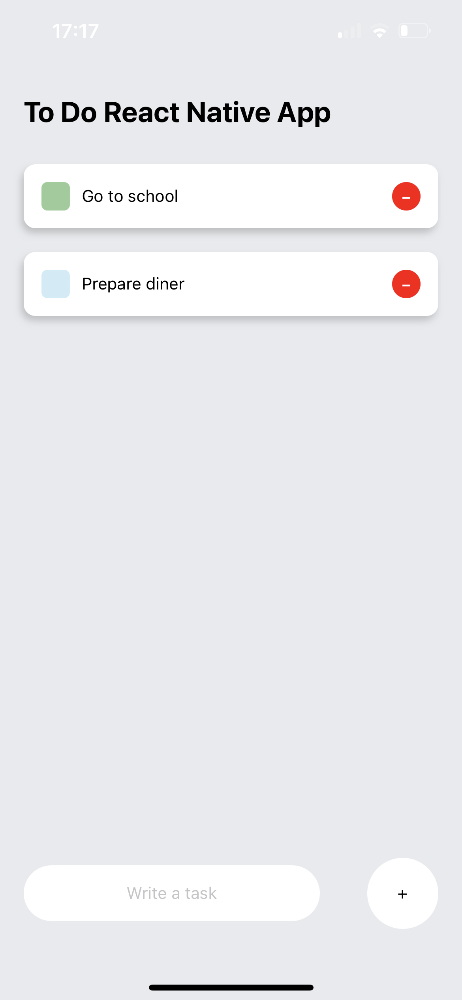

# React native ToDo App

# Table of Content

1. [Installation guide](#installation-guide)
2. [Demonstration](#demonstration)

## Installation guide

``` shell
git clone https://github.com/thibault-cne/react-native-app
cd react-native-app
```

``` shell
npm install
npm start
```

You can then follow ```expo``` indications to run on devices or on the web.
You can refer to the expo documentaion [here](https://docs.expo.dev).

## Demonstration

Here are some pictures of the app.

<div>
    <div float="left" align="center">
        
        
        
    </div>
    <div float="left" align="center">
        
        
    </div>
</div>

## Features

- You can add/remove tasks.
- You can mark as done/undone any tasks.
